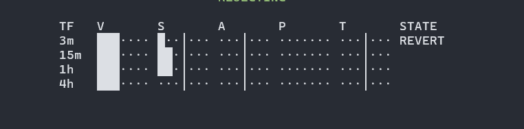

Signed metrics (S / A / P / T)

bin0  ███│ · · ·
bin1   · ██│ · · ·
bin2   · ·  █│ · · ·
bin3   ·  ·  · │ · · ·
bin4   ·  ·  · │█ · ·
bin5   ·  ·  · │██ ·
bin6   ·  ·  · │███

Unsigned metric (V)

bin0  · · · · · · 
bin1  █ · · · · · ·
bin2  ██ · · · · ·
bin3  ███ · · · ·
bin4  ████ · · ·
bin5  █████ · ·
bin6  ██████ ·

UI shows

TF   	V	        	S	        	A       		P	        	T 	           STATE
3m   ████··· 		 ···│█·· 		 ···│██· 		 ·██│··· 		 ···│██·  		   CONT+
15m  ██·····  		 ···│··· 		 ···│█·· 		 ······· 		 ···│··· 		   NEUT
1h   █······	     ···│··· 	     ··█│···         ·······  	     ·██│···  	       COMP
4h   █······ 		 ···│··· 		 ··█│··· 		 ······· 		 ·██│···  		   COMP

Current UI
